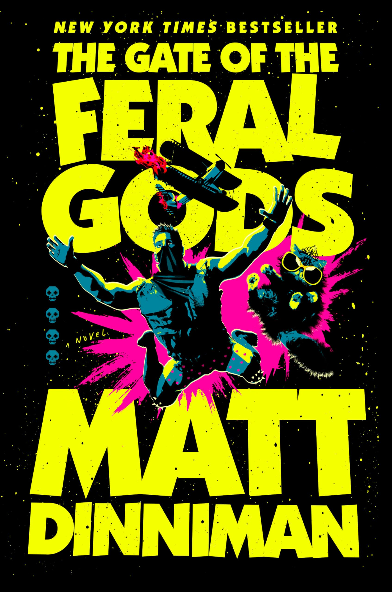

## The Back Cover

You failed a quest less than five minutes after you received it. Now that’s talent.
A floating fortress occupied by warrior gnomes. A castle made of sand. A derelict submarine guarded by malfunctioning machines. A haunted crypt surrounded by lethal traps. 
It was supposed to be easy. One bubble. Four castles. Fifteen days. Capture each one, and the stairwell is unlocked.
Here's the thing. It's never easy. Carl and his team can't go it alone. Not this time. They must rely on the help of the low-level, I-can't-believe-these-idiots-are-still-alive crawlers trapped in the bubble with them. But can they be trusted? 
Welcome, Crawler. Welcome to the fifth floor of the dungeon.

## My Thoughts

This is the fourth book in the Dungeon Crawler Carl series, but the first review I've done of one. This book brings Carl to a brand new level of this insane dungeon but a bit of an easier return to simple mechanics after the maze that was book #3. I've loved all of these so far but I'm not going to lie, book 3 really challenge me. Now we're back to a more reasonable pace and an understandable dungeon level.

We have tons of of wild puzzles and solutions in this book and maybe some of the more creative monsters and boss fights this time around. There's a dang octo-shark (or is it sharktopus?) 

I think the strong point in this book was really the overall plot movement and the pacing. There's actually not a ton of character development or major changes made to anyone in this book. If anything this book has set Carl up as a bit "bossy" when it comes to all the extra characters. I love Carl, but it would be nice if we could get more ideas from some of the people around him like Katia. I don't expect a lot out of Donut, but she's great fun as always. I'm thinking that we're probably going to see Carl have to rely on his friends more in the next book, but we'll see.

Overall, I liked it. It took me a long time to get through the previous book and I was worried that I was maybe just falling out of love with the series, but it was just a tough book to get through. This one, albeit massive at 580 pages, was a bit more of a good time and I found myself tearing through it at a much faster pace.

The epilogue also brought us some cool world development stuff that got me pretty excited. We haven't seen much about the surface since the start of the book series and we finally get a view of what's been going on up there. That has me pretty dang excited for the next book. I might take a little break and read something else because these books are a lot, but overall I've enjoyed the series and am excited for more.

## Rating

3.5 out of 5 

