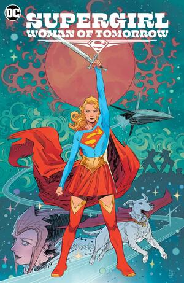

## Summary

 Kara Zor-El has seen some epic adventures over the years, but she now finds her life without meaning or purpose. Here she is, a young woman who saw her planet destroyed and was sent to Earth to protect a baby cousin who ended up not needing her. What was it all for? Wherever she goes, people only see her through the lens of Superman's fame.

 Just when Supergirl thinks she's had enough, everything changes. An alien girl seeks her out for a vicious mission. Her world has been destroyed, and the bad guys responsible are still out there. She wants revenge, and if Supergirl doesn't help her, she'll do it herself, whatever the cost. Now a Kryptonian, a dog, and an angry, heartbroken child head out into space on a journey that will shake them to their very core.

## My Thoughts

I have never been a fan of Supergirl, but I have never NOT been a fan of Supergirl either. She's just kind of been there on the outskirts of the DC comics that I always loved to read. I was a huge fan of the 80s movie when I was a kid for whatever reason, but it's objectively terrible and I have no idea why 5 year old me was so into it. Maybe a young crush on Helen Slater? Who knows?

What I know now is that this book has made me into a fan.

The last time I read anything about Supergirl was in a 2000s run of Batman & Superman. It was a new origin story of sorts where they find Kara Zor-el freshly arrived on earth. I remember that being a decent story, but I also remember this was the 00's and comic book women were drawn to be very visually appealing more than to have a lot of substance. The lucky ones got both. I just don't remember her story all that much from those books. It was fun to see an origin though

This book on the other hand is something entirely different. The Supergirl we meet in Woman of Tomorrow is broke down. She's on a planet with a red sun, drinking away her sorrows on her birthday. We meet a woman at the beginning of this book who is keenly aware of all the things she's lost when her planet blew up, and having to deal with a world that loves her cousin and a whole bunch of enemies that hate her because she's related to him. What a wild start!

The thing that may have surprised me more about this book was that this isn't necessarily Supergirl's story. This is the story of another girl, whose father was struck down by a bad dude on his farm. This girl is on a quest for vengeance and needs a mercenary to join her to take him down. Supergirl just happens to be that mercenary, but not willingly. At least not at first. Until something happens to Krypto. Yeah, that's right. She has her dog with her.

I don't want to spoil everything in this review, but this book was absolutely stunning. It was far more wordy than a lot of comic books I've read, and it does a lot in square blocks and narration, but it works. It's effectively the story of a girl who goes on an adventure with a superhero and gets to see all the things she does. The way Tom King wrote this is so full of prose that stops short of poetry, but is pretty close just by how elegant it all is. This is a weird book, but one that finds moments where it's not bogged down by sci-fi weirdness. There's a lot of humanity in these aliens that we meet on the adventure. Humanity that is shown to be both beautiful and terrible. 

I loved this book. I heard it's the inspiration for the Supergirl that will be in the DCU as the movies get produced. If this is the girl we get, we're in for a treat. 

## Rating

4 out of 5

## Recommendation

People who love comics and particularly deeper ones with some real meat on their bones. This was definitely not a kid's book.

