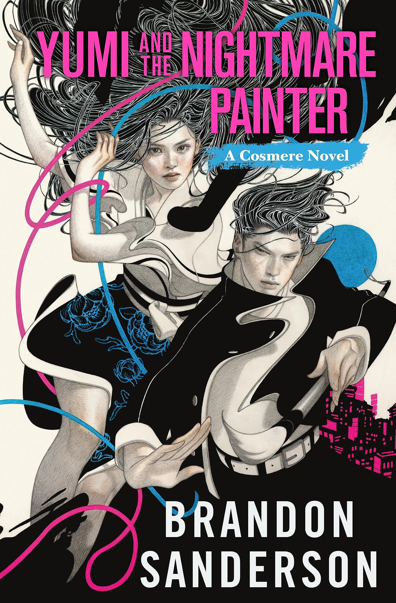

## The Back Cover

Yumi and The Nightmare Painter is a standalone cosmere novel by Brandon Sanderson that tells the story of two people from different worlds whose lives become intertwined in unexpected ways. Yumi is a yoki-hijo, a ritual artist who stacks stones to appease spirits and provide for her people. Painter lives in a world where nightmares take physical form and must be destroyed by artists who paint them away. When a mysterious phenomenon causes their souls to swap during their daily routines, both must learn to navigate each other's worlds while uncovering the truth behind their connection.

## My Thoughts

I have never read a Brandon Sanderson book. It might come as a shock given that I love fantasy stories, but I've just missed out on his Cosmere universe. I'm not avoiding it, I'm just really lazy and his books are really long. That all changed about a week ago when my wife picked up _Yumi and The Nightmare Painter_. She insisted that I would love it. After the usual questions over whether this was another smutty fantasy novel like Fourth Wing or anything by Sarah J. Maas, I decided I'd give it a try.

It took me a few chapters but once I was in, I couldn't stop reading it. It's sort of a traditional romance story but with a ton of wild fantasy stuff and a captivating and strange world. There's a boy and a girl who are more similar than they are different but it takes them a long time to figure that out. They're tied together by some sort of mystical energy that I still don't fully understand, but I also don't have to. One lives in a world of technology based on something called "hion" lines while the other lives in a small community of people who survive by harnessing the power of spirits to take care of their needs. Yumi is one of those spirit conjurers, known as yoki-hijo, and The Nightmare Painter, Nikaro, is a basically a beat cop on his world who defends his people from "nightmares." 

These characters are so fully fleshed out so easy to read about. I really didn't know what to expect. I guess I was convinced that this would be some kind of high fantasy style book that was more interested in its world building and magic systems than its characters. I was so happy to find a fantasy novel where characters came first and the magic and sci-fi elements were kind of background noise to what we were actually reading about. Every chapter ended with me having learned a little bit more about the world but mostly about how these people operated in it. I watched this blossoming love story come to life in front of me in the most organic and believable way. The tension was sort of in this looming threat of nightmares, but it also took a backseat to just watching both of these people adapt to their weird circumstances and trying to make the best of it. And, no, it never got steamy like some of those novels.

I think this book has everything you might want out of a well rounded fantasy novel. It was a story about forgiveness, love, and freedom with a dash of justified rebellion rolled in. I loved watching Yumi learn how to do what she wanted to do after having grown up in a world where she was told what to do all day. She kind of reminded me of a geisha by the way she was written and how she lived. This is also a story about art. There's a John Henry aspect to some of this that wants to tell the reader that art can't be replicated by machinery. It's something that only humans can do because we're the only ones that can experience life like we do. There's no machine on earth that can understand what we are and what our livse are like. Art is our uniquely human expression of that journey. 

It was so good. I loved this book.

## Rating

4 out of 5. 

