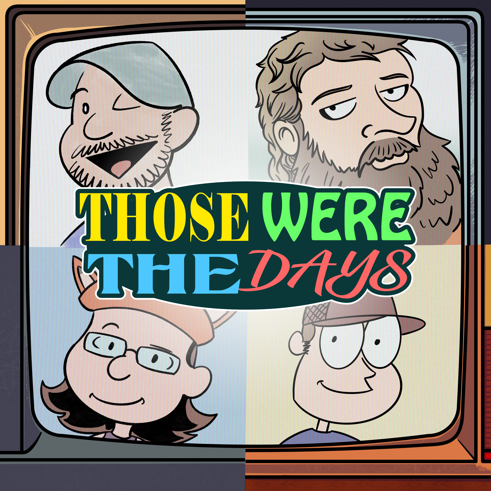
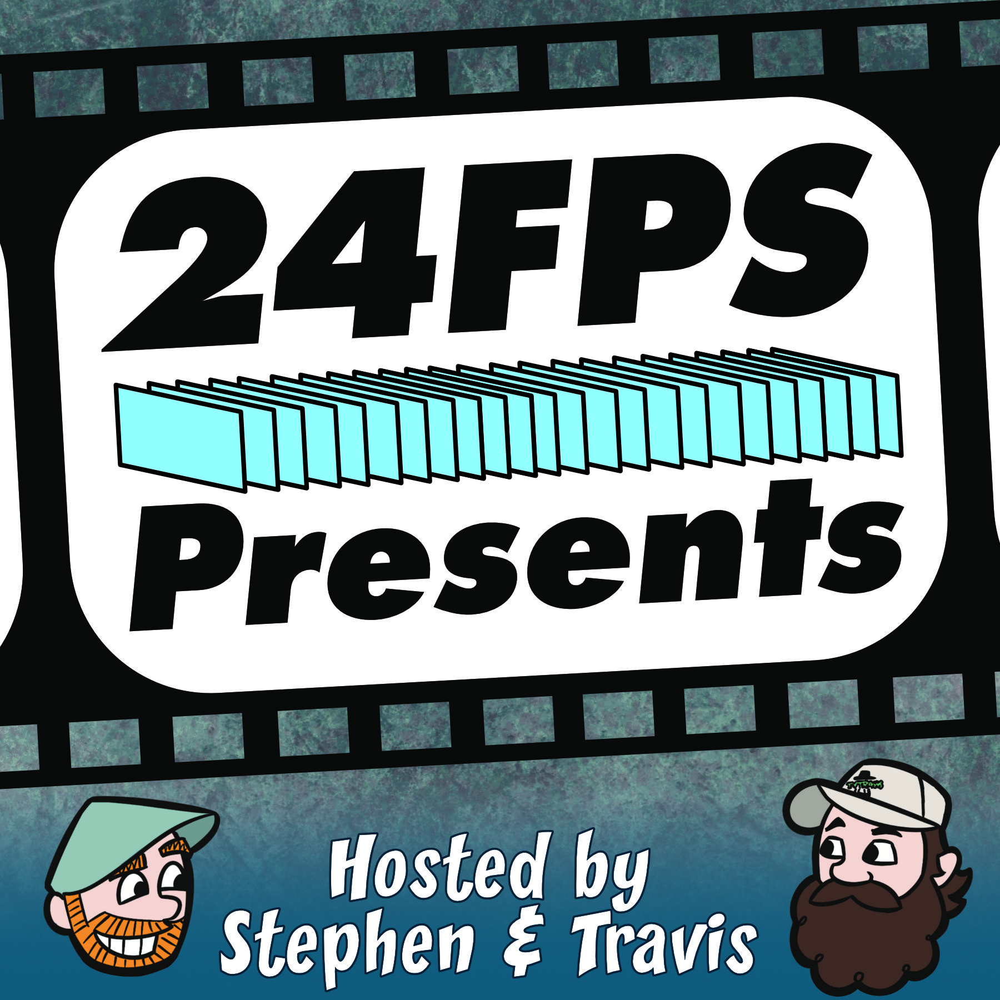

# Those Were The Days

Dive into the golden age of television with Stephen, Amy, TVsTravis, and Audie! Every week, our fab four journey back in time to revisit and revamp a classic TV show. From iconic one-liners to those unforgettable plot twists, no scene goes unnoticed. Peppered with a mix of witty banter, behind-the-scenes tidbits, and a touch of nostalgic magic, this is the ultimate audio time machine for TV lovers. Whether you’re reminiscing about your favorite episodes or discovering a vintage gem for the first time, "Those Were The Days" promises laughs, surprises, and a hearty dose of TV nostalgia. Grab your popcorn, tune in, and let’s rewind the tape!

[Subscribe](https://shows.acast.com/thosewerethedays)

# 24 FPS Presents...

24FPS Presents... is Stephen Adams and TvsTravis exploring the filmscape together. Going through popular franchises, as well as tackling the filmographies of famous directors and actors. Some movies they've seen, and a lot they haven't. Bringing together a massive nerdy knowledgebase and a passion for movies, they're here to start the discussion with you! Grab a seat, a bucket of popcorn, and let's watch some movies together!

[Subscribe](https://shows.acast.com/24-fps-presents)
