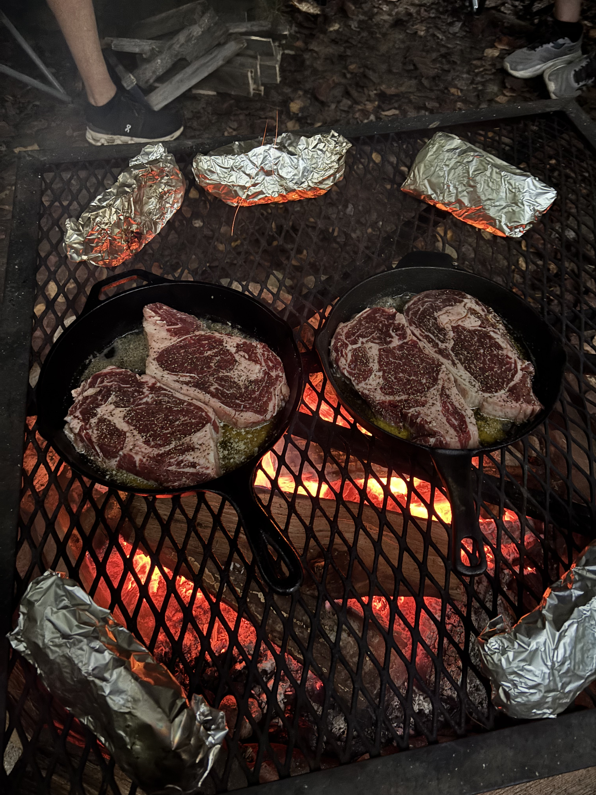
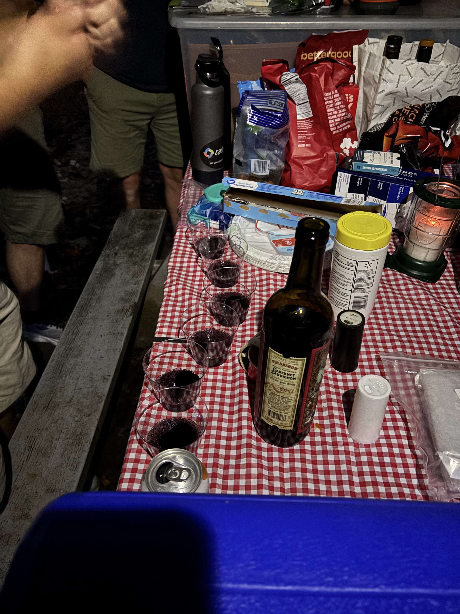

Every year, my men's group goes on a camping trip into the mountains for a weekend of good food, games, fellowship, and way too expensive bourbon. It's a tradition we've held since 2021, when we all really needed to get away and spend some time with each other and with God in nature. 

It grew out of a bit of a desire for adventure. We all work city jobs in a city setting, and generally sit while doing it. It made sense to take ourselves out of the comfort of every day and go to the somewhat less comfortable outdoors. My friend, Brian, knew a guy who lived in a mountain community that has a pretty great campsite. It's not exactly in the middle of nowhere, but it's not nicer than any other campsite just because it's in some community. We're down in a valley next to a beautiful creek, and at night you would bet there was no one around for miles. It's beautiful and quiet and an excellent break from the norm. Not to mention there isn't a single cell phone provider that works down there. I'm effectively cut off from society for a full weekend.

This year was just as refreshing as any of the others, but we did have a wild curve ball thrown our way. It stormed quite a bit for a good deal of the weekend. We managed to pick the weekend amongst many rainless ones where the storms came through and really let us test our mettle. I'm so proud of what we did though. We got a ton of tarps set up, and didn't let the rain get us down. If anything, we had just as much fun and learned what we were capable of. I think the only thing any of us actually complained about was that the rain on the tarps made it way harder to hear each other than we would have liked. Other than that it was great.

During the biggest storm of the weekend, we were getting two gallons of water off the tarp every minute. We had it draining into a bucket because we were just curious how much it was actually raining. We also happened to be cooking steaks on the fire at the time. The rain really came pouring in at one point when our steaks were done, and we all ended up eating with our hands. It was dark by then, so we couldn't see anything. We all sat around eating our steaks like a bunch of barbarians and it was absolutely beautiful. The rain subsided a bit and then we all did communion together.

I'll say this about spending time with good Christian men like this. It really gives me a clue into what it must have been like for the disciples to spend time with each other. We were standing around while my friend, Derek, led us in communion and it was probably one of the most beautiful ones I've been apart of. We drank wine and broke bread much in the way I'd imagine the disciples did at the last supper. We had a loaf of french bread that we passed around tearing off a chunk. If you think about it, the disciples were a group of friends following another friend, so really at the end of the day, they were a group of friends just sharing a moment together. I've done a lot of communions in my day, and this one was probably the purest of them all. No pre-manufactured plastic cup and barely edible wafer. It was people remembering the sacrifice Jesus made so that we didn't have to die. I'll never forget spending that moment huddled under a canopy in the pouring rain sharing that together.

We also went on our traditional hike and ate our MREs like we do every year. It's so fun cracking open those "Meals Ready to Eat" and seeing who got what candy or treat and if the food was any good. Every year I've been lucky. This year I even got Peanut M&Ms in mine! Jackpot! It tastes delicious after having gone on a 2 mile hike and really made it worth it. 

All I can say is that if you don't have yourself a good group of friends to disappear into the woods with for a weekend, go find one. I would take a bullet for any one of these guys. Having a crew to really be vulnerable with, to share my biggest concerns, and my most difficult moments is really a wonderous thing. I know they'll guide me and help me out in a way that I need, and not just tell me what I want to hear. It really means so much.

I already can't wait for next year's camping trip. It really is my favorite thing every year, and I do a lot of cool things.
