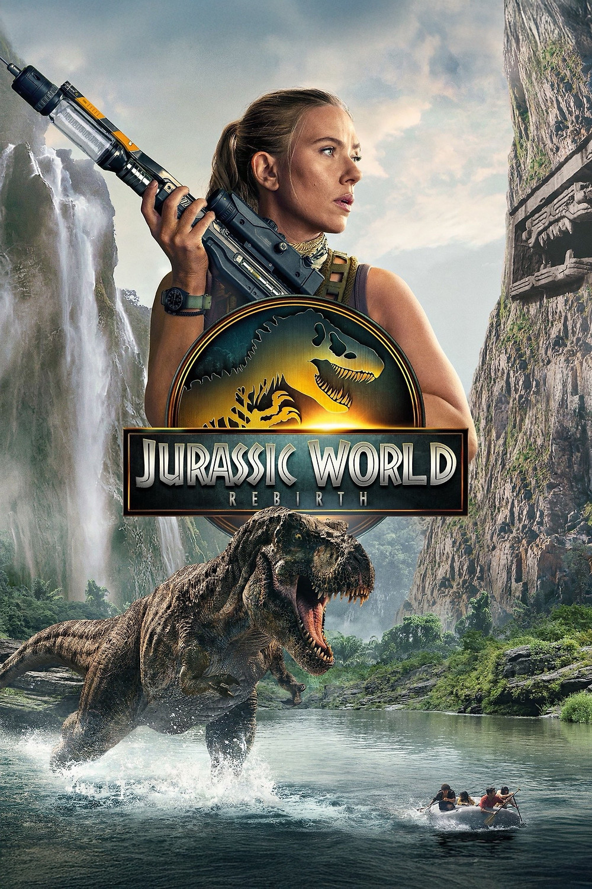

## Summary

Five years after the events of Jurassic World Dominion, covert operations expert Zora Bennett is contracted to lead a skilled team on a top-secret mission to secure genetic material from the world’s three most massive dinosaurs. When Zora’s operation intersects with a civilian family whose boating expedition was capsized, they all find themselves stranded on an island where they come face-to-face with a sinister, shocking discovery that’s been hidden from the world for decades.

## My Thoughts

I had lost a lot of confidence in the Jurassic franchise over the last few movies. I didn't hate Jurassic World, but I found almost nothing worthwhile from the second and third movie in that trilogy. The actors were doing their best to sell the story, but the problem was that the story just wasn't all that interesting. Genetically modified dinosaurs and all the monster action just didn't work for me. I hoped that this new movie might change things up and send us back into what made us love dinosaurs in the first place.

It mostly succeeded at that mission.

I say that not because this movie is spectacular or made me even love dinosaurs that much. It did manage to keep me on the edge of my seat and my mouth dropped open more than once watching some of the action on the screen. All in all, the movie was pretty run-of-the-mill as monster movies go, but the suspense and thrills were definitely way better than the previous two outings.

Scarlett Johansson did a fantastic job carrying this flick along with Mahershala Ali, who I always love. They really worked for me as the primary heroes in the movie and I even had a good time with Johnathan Baily as Henry Loomis. The whole team itself was actually pretty dang terrible at the job they're supposed to be the best at, but I was able to park my brain and just enjoy what they were up to. The subplot with the family that accidentally ended up on this journey really wasn't that impressive and was a bit of a distraction, but it gave us someone who wasn't an elite soldier to watch. I also think it's a requirement that there be kids in danger when it comes to these movies.

The story itself leaves a bit to be desired. We have mutant dinosaurs that were experimented on because "people got bored" which checks out. That's incredibly meta considering in 1993, a dinosaur on screen melted our brain. Now we just ... don't care that much. The mcguffin of the dino blood to end cardiac disease was kind of fun. It at least gave us something to do. The issue I have with plots like that is that it creates a checklist story model. Kind of like a video game where you have levels you have to complete to move onto the next thing. All in all though, it worked for me as a vehicle to get us to the next big thriller moment and those are where this movie shined for me.

If I had one complaint it's that the movie moves at a snail's pace at the beginning. It takes a solid hour before anything happens, but once it gets going it tends to roll pretty steady from exciting moment to exciting moment. It also did something that I was bothered by right at the beginning. There were 4 different text scenes at the beginning to explain the current status of the world in relation to the dinosaurs. The issue I have with it is not really that we sat through 30-40 seconds of text, but that the same text was repeated again by the characters shortly after the movie starts. We didn't need to read it, because the characters said the same info within the first 5 minutes. That bothered me a lot and I'm struggling to shake that off.

All in all though, I walked out having had a great time with this movie. It was far from perfect. It did nothing to make me really want more of this world. But it did put me on the edge of my seat a few times. I also watched it with my 10 year old, and he loved everything about it, so that probably skews my opinion into the positive. I'm good with that though. I go to movies in hopes that I'll enjoy them, not that I can poop all over them. If my kid helped make me enjoy this more, then I'll take it.

It's definitely a movie worth your time if you enjoy Jurassic World. But if you're on the edge of whether to see it at a theater, you could probably get by with watching it when it comes to streaming.

## Rating

3.5/5 stars

## Recommendation

Definitely theater worthy, but if you're not really into Jurassic World you can wait until it comes out on streaming.

