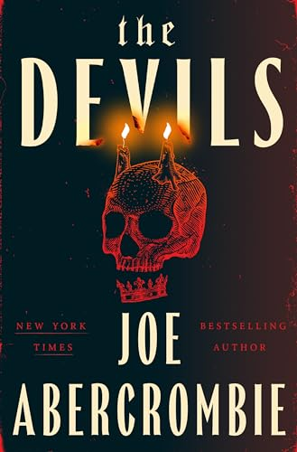

## The Back Cover

Brother Diaz has been summoned to the Sacred City, where he is certain a commendation and grand holy assignment awaits him. But his new flock is made up of unrepentant murderers, practitioners of ghastly magic, and outright monsters. The mission he is tasked with will require bloody measures from them all in order to achieve its righteous ends.

Elves lurk at our borders and hunger for our flesh, while greedy princes care for nothing but their own ambitions and comfort. With a hellish journey before him, it's a good thing Brother Diaz has the devils on his side.

## My Thoughts

I'm a big fan of Joe Abercrombie. Ever since I pulled _The Blade Itself_ off the shelf because the cover looked pretty cool, I've been addicted to his style. I think it's because he writes such engaging and interesting characters. His plots often meander all over the place and sometimes leave you with more questions than answers, but I have the best time getting to know the cast of weirdos he tends to throw at you in every book.

The Devils is a refreshing work of art in his catalog. It's a simple story that really at the end of the day is a journey from point A to point B with a cast of legendary characters that aren't unlike The Avengers in a way. All these monsters have to do is get someone from one place to another but the entire journey is frought with interruptions and people trying to stop them. It's simple on its face, but there's complexity in the way he writes these people and in the reason they are on this journey in the first place. 

We're lumped in with a pretty incredible group of dark fantasy superheroes. We have a werewolf, a vampire, a necromancer, an immortal, an invisible elf, and a bad ass. It sounds like a perfect D&D crew to me and it works. We also have Brother Diaz, who is mainly our human proxy so we know how to feel in this weird world. And then we have Alex, who is a bit of a McGuffin in this story and the person we want to get to the destination.

If you like other Joe Abercrombie books, you'll definitely love The Devils. I actually think its his best book since Red Country. I adored Red Country, and this is very similar in that we're making our way across the world and learning things along the way, but this is outside that First Law world that we've come to know. It's kind of an alt-history world where some places and names seem familar but they've been twisted around as if they happened in an alternate reality. The biggest player here is what I'll just call "The Church." There's a Pope, a savior, a hierarchy and all that, but it's vastly different from what we would recognize as The Church here. There's definitely a snarky view of how all that works, but it definitely works for this world, and I guess ours as well most of the time. 

It did take me a little while to get into this one. It was probably well into the second act before I figured out what we were really doing and what the point was. That's not unusual for his books for me, but I'm glad I pushed through this one. By the time I was in the middle of the story, I was fully invested in what was going on with these people, and I was rooting for them. Particulary for Jakob of Thorn, who I'd compare to our Captain America in this scenario. 

I love that the archetypes that we know and love from other genres are all here, but just turned on their head enough that they seem new and fresh. Telling a story about a group of overpowered heroes is not a new thing, but the way Abercrombie tells it, it feels like something novel. I think if you're a fan of his work and adventure stories, you'd get a kick out of this.

Shortly after the book came out, James Cameron announced that he'd acquired the rights to produce this into a movie. I'm not sure if we'll see that happen because we see books get optioned all the time, but I'm hoping it does. I'd definitely watch this thing. It plays out so cinematically anyway that it lends itself really well to adaptation.

I had a good time with this and I'm looking forward to more adventures with the Chapel of the Holy Expediency in the future.

## Rating

4 out of 5 

